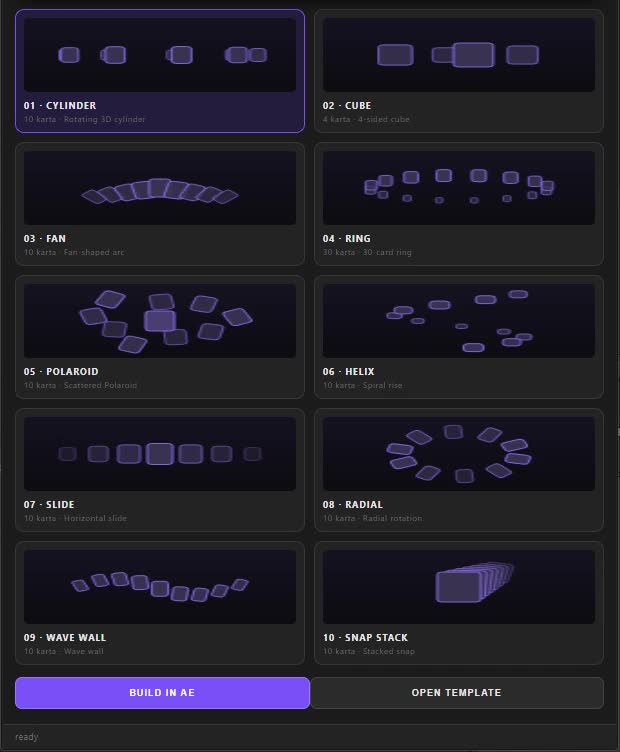

<p align="center">
  
</p>

<h1 align="center">HUMBLE Carousel</h1>

<p align="center">
  <strong>10 ready-made 3D carousel styles for Adobe After Effects.</strong>
</p>

<p align="center">
  Build cinematic carousel animations faster with one focused After Effects panel.
</p>

<hr>

## ✨ What is HUMBLE Carousel?

**HUMBLE Carousel** is an After Effects panel designed to make carousel-style animations quick and easy.

Choose a style, add your media, and build the animation without creating the setup from scratch.

### Features

- 🎞️ **10 ready-made carousel styles**
- ⚡ Fast workflow inside After Effects
- 🎛️ One focused panel
- 🖼️ Works with your own media
- 🌀 Multiple 3D carousel layouts
- 🖥️ Windows + macOS
- 🎬 After Effects 2022+
- 📦 Simple installation
- 🎨 Designed by HUMBLE Studio

---

## 🎠 Included Styles

| # | Style |
|---|---|
| 01 | Cylinder |
| 02 | Cube |
| 03 | Fan |
| 04 | Ring |
| 05 | Polaroid |
| 06 | Helix |
| 07 | Slide |
| 08 | Radial |
| 09 | Wave Wall |
| 10 | Snap Stack |

---

## 📦 Download

### HUMBLE Carousel 1.0.3

[**⬇️ Download HUMBLE Carousel**] (https://humblelyy.github.io/HUMBLE-Carousel/)

**Compatibility:** Adobe After Effects 2022+

**Platforms:** Windows · macOS

---

## 🛠️ Installation

### Windows

Copy the `HUMBLE_Carousel_1.0.3` folder to:

```text
C:\Program Files (x86)\Common Files\Adobe\CEP\extensions
```

Then open After Effects:

```text
Window → Extensions → HUMBLE Carousel
```

### macOS

Copy the `HUMBLE_Carousel_1.0.3` folder to:

```text
~/Library/Application Support/Adobe/CEP/extensions/
```

Then open After Effects:

```text
Window → Extensions → HUMBLE Carousel
```

> **Note:** CEP extensions may require CEP developer mode depending on your After Effects setup.

---

## 🎥 Preview

<p align="center">
  
</p>

---

## 🧩 Compatibility

| Software | Support |
|---|---|
| After Effects 2022 | ✅ |
| After Effects 2023 | ✅ |
| After Effects 2024 | ✅ |
| After Effects 2025 | ✅ |
| After Effects 2026 | ✅ |
| Windows | ✅ |
| macOS | ✅ |

---

## 📁 Project Structure

```text
HUMBLE-Carousel/
├── assets/
│   ├── styles/
│   ├── carousel-poster.jpg
│   ├── carousel-styles.mp4
│   ├── humble-logo.png
│   └── HUMBLE_Carousel_1.0.3.zip
├── public/
├── src/
├── index.html
├── package.json
├── vite.config.js
└── README.md
```

---

## 🌐 Links

- 🌐 **HUMBLE Studio:** https://humblelyy.github.io/HumbleStudio/
- 💻 **GitHub:** https://github.com/humblelyy
- 📸 **Instagram:** https://www.instagram.com/_humble.y_/
- ▶️ **YouTube:** https://www.youtube.com/@humbleae
- 💼 **LinkedIn:** https://www.linkedin.com/in/mahesh-madhav-602683357

---

## 💖 Credits

Created by **HUMBLE Studio**.

Built for creators who want to spend less time setting up carousel rigs and more time editing.

<p align="center">
  <strong>HUMBLE</strong> · Video Editing Tools & Creative Experiments
</p>

---

<p align="center">
  <sub>© 2026 HUMBLE Studio</sub>
</p>
